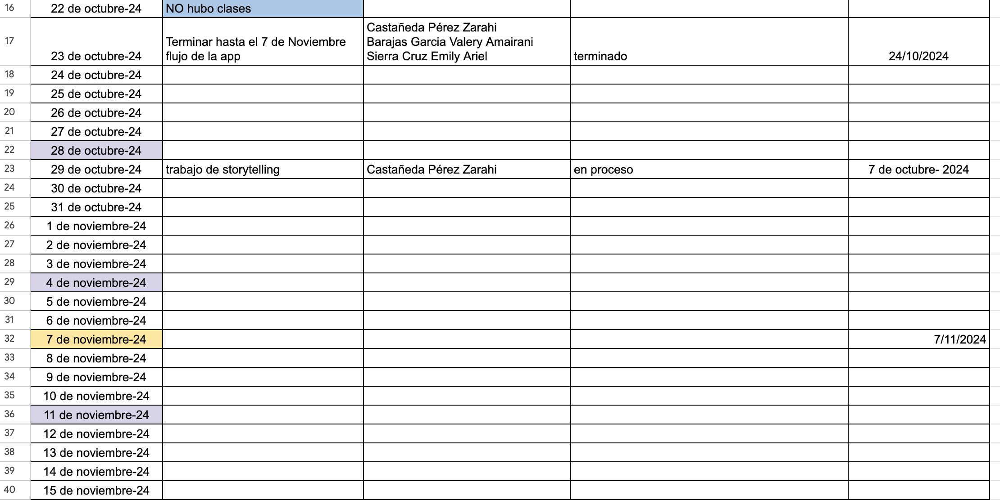

# Proyecto-tics

Parte 1
1. Encuesta
2. Planeacion y seguimiento
3. Storytelling 
4. Presentacion
5. Investigacion y diseño de usuario
6. Mockups iniciales 

Encuesta 
Definir un problema local dentro del plantel y crea runa encuetsa suando google forms
u otra herramienta. Recabar datos con esas preguntas.

Planeacion
Crear una tabla en excel con la planeacion
con las columnas: Fecha de inicio|Actividades|Participantes|Fecha limite|Estado|prioridad
* Estado y prioridad como opcional si lo consideran necesario. 
Crear las tareas en Trello y asignar miembros del equipo que lo hagan.

Ejemplo de Planeacion. Hecha por alumnos de 1 semestre.

3. 
Ejemplo de story telling: 
Usa los datos recabados en la encuesta, la pregunta y el planteamiento del problema con 
el que se hizo la encuesta.

Enfoque paso a paso para desarrollar un proyecto sobre una problemática escolar usando storytelling. 
El storytelling ayudará a captar la atención de los lectores y a comunicar la importancia del problema y las posibles soluciones.

Ejemplo de Problema: La Falta de Hábitos de Estudio en los Estudiantes de Bachillerato

Paso 1: Define el Problema

	1.	Identifica la problemática: Piensa en problemas comunes entre estudiantes, como la falta de hábitos de estudio, baja motivación, distracciones tecnológicas, o falta de organización.
	2.	Redacta el problema en términos claros: En este caso, la problemática es la falta de hábitos de estudio, lo que afecta el rendimiento académico y la preparación de los estudiantes para exámenes y proyectos.

Paso 2: Construye una Narrativa (Storytelling)

Imagina una historia que refleje la problemática de manera personal y relatable. Un ejemplo de narrativa para esta problemática podría ser:

	1.	Personaje principal: Crea un personaje ficticio, como “Luis”, un estudiante de 16 años de bachillerato.
	2.	Describe la situación actual de Luis:
	•	Contexto: Luis acaba de recibir sus calificaciones parciales y está decepcionado. A pesar de estudiar la noche antes de los exámenes, sus notas no fueron buenas.
	•	Dificultad: Siente que dedica tiempo, pero no obtiene los resultados que espera. Su concentración se ve afectada por el celular y no tiene un plan de estudio claro.
	3.	Incidente desencadenante: Un profesor llama a Luis para hablar sobre su rendimiento, explicándole la importancia de los hábitos de estudio.
	4.	Desarrollo de la historia:
	•	Luis decide intentar un cambio en su método de estudio. Con el apoyo de un profesor y sus padres, crea un horario, apaga el teléfono mientras estudia y usa técnicas de estudio como la técnica Pomodoro y la toma de apuntes.
	•	Experimenta una mejora en sus resultados y empieza a sentir más confianza en sí mismo.
	5.	Resolución: Para el siguiente periodo de exámenes, Luis obtiene mejores calificaciones y se siente satisfecho con su esfuerzo y resultados.

Paso 3: Investigación y Análisis del Problema

	1.	Recopila datos: Investiga sobre la falta de hábitos de estudio en estudiantes. Busca estadísticas, estudios de caso o entrevistas con profesores y alumnos para darle credibilidad a tu proyecto.
	2.	Identifica causas y efectos:
	•	Causas: Distracciones tecnológicas, falta de orientación en métodos de estudio, presión social.
	•	Efectos: Bajo rendimiento académico, estrés, falta de motivación.
	3.	Ejemplos prácticos: Incluye testimonios o citas de estudiantes o profesores sobre cómo afecta esta problemática a la vida estudiantil.

Paso 4: Propón Soluciones

Desarrolla estrategias basadas en la narrativa que podrían aplicarse en la vida de los estudiantes. Algunas soluciones podrían ser:

	1.	Capacitación en técnicas de estudio: Talleres para enseñar a los estudiantes métodos efectivos de estudio como la técnica Pomodoro, lectura activa o mapas mentales.
	2.	Programa de mentores: Asignar mentores académicos que ayuden a los estudiantes a mejorar sus hábitos de estudio y a planificar mejor su tiempo.
	3.	Espacios de estudio libre de distracciones: Promover áreas en la escuela donde los estudiantes puedan estudiar sin distracciones tecnológicas.
	4.	Aplicación de herramientas digitales: Usar aplicaciones de gestión de tiempo o bloqueo de distracciones para ayudar a los estudiantes a concentrarse.

Paso 5: Presenta los Resultados y el Impacto

	1.	Evidencia de impacto: Proporciona ejemplos de cómo estas soluciones han mejorado el rendimiento de estudiantes en otras escuelas o lugares.
	2.	Seguimiento de resultados: Explica cómo se podría implementar un sistema de evaluación para medir el impacto de las soluciones propuestas, como encuestas de satisfacción o resultados académicos a lo largo de un semestre.
	3.	Reflexión final: Cierra el proyecto destacando la importancia de los hábitos de estudio en el desarrollo académico y personal de los estudiantes.

Formato Final del Proyecto

Portada

	•	Título del proyecto.
	•	Nombre del estudiante.
	•	Materia y grado.

Índice

	Lista de secciones para fácil referencia.

Introducción

	Explicación breve del proyecto y de la problemática.

Narrativa (Storytelling)

	La historia de “Luis” y cómo la falta de hábitos de estudio afecta su vida.

Investigación y Análisis del Problema

	Detalle del problema con datos y causas/efectos.

Soluciones Propuestas

	Estrategias y planes detallados para enfrentar el problema.

Resultados Esperados e Impacto

	Posibles mejoras y cómo medir el éxito de las soluciones.

Conclusión

	Resumen de la importancia de las soluciones y el impacto positivo en la vida escolar.

Referencias

	Citas, estudios y fuentes utilizadas en la investigación.

Ejemplo de un equipo de 5 semestre

Presentacion

Para la Primera Parte, enfocada en la investigación, organización y planificación del proyecto. Esto les ayudará a estructurar su trabajo y comunicarlo de forma clara.

Instrucciones para la Presentación en PowerPoint o Google Slides

Objetivo: Que los estudiantes expongan el análisis del problema, su planeación y organización del proyecto, destacando las herramientas de seguimiento y el cronograma.

Estructura de la Presentación

	1.	Portada
	•	Nombre del proyecto.
	•	Nombre de los integrantes.
	•	Curso y fecha.
	2.	Introducción al Problema
	•	Descripción breve: Enfoque en la problemática escolar que están resolviendo.
	•	Storytelling: Narrativa o historia que desarrollaron, mostrando cómo la problemática afecta a los estudiantes.
	•	Importancia: Razón por la cual eligieron esta problemática y el impacto que esperan lograr.
	3.	Objetivos del Proyecto
	•	Objetivo principal: Descripción clara y concisa del objetivo general de su proyecto.
	•	Metas específicas: Indicadores clave para medir el éxito de su proyecto (pueden enlistar de 2 a 3 metas).
	4.	Análisis del Problema
	•	Datos clave o estadísticas: Puntos de información que respalden la problemática (si es posible).
	•	Causas y consecuencias: Presentación de causas principales y los efectos de la problemática. Pueden usar viñetas o un diagrama sencillo.
	5.	Planeación y Organización
	•	Uso de Trello o Google Sheets/Excel:
	•	Explicación de cómo organizaron las tareas y dividieron el trabajo.
	•	Capturas de pantalla de su tablero en Trello o Google Sheets, mostrando las columnas o secciones utilizadas (ej. “Pendiente,” “En Proceso,” “Completado”).
	•	Cronograma o Timeline:
	•	Breve cronograma con las fases del proyecto y fechas estimadas de entrega.
	•	Roles y responsables de cada tarea principal.
	6.	Propuesta de Solución
	•	Resumen: Explicación breve de la solución que planean implementar.
	•	Impacto esperado: Cómo esta solución beneficiará a los estudiantes y resolverá la problemática identificada.
	7.	Seguimiento y Evaluación
	•	Progreso: Explicación de cómo planean monitorear el progreso, como reuniones semanales de revisión.
	•	Herramientas de seguimiento: Ejemplos de cómo usarán Trello o Google Sheets para ver el avance.
	8.	Conclusión
	•	Resumen: Revisión rápida de los puntos clave (problema, objetivos, organización).
	•	Expectativas: Resultados esperados al finalizar esta primera fase.

Consejos para la Presentación

	•	Visualización clara: Usen gráficos, tablas y diagramas cuando sea posible.
	•	Puntos clave: Mantengan el texto en las diapositivas breve y directo.
	•	Organización: Sigan el orden propuesto para que la presentación fluya y los espectadores entiendan cada sección.

Recursos Sugeridos

	•	Trello: Para organizar el proyecto, dividir tareas y visualizar el progreso.
	•	Google Sheets o Excel: Para control de tareas y fechas.
	•	PowerPoint o Google Slides: Para crear una presentación atractiva y profesional.

Ejemplo de un equipo de 5 semestre

